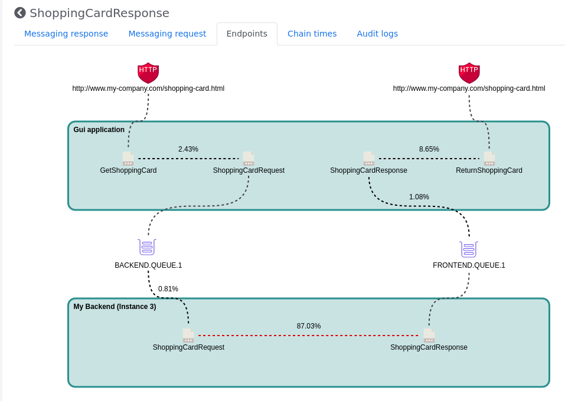

# Enterprise Telemetry Monitor

Enterprise Telemetry Monitor is a highly scalable event processor. The goal of Enterprise Telemetry Monitor is to gain near realtime insights in the information flows inside and between your enterprise applications. It is generally used to help organizations monitoring their complex application landscape.

A few sample usecases that Enterprise Telemetry Monitor could be used for:

* Correlating events from different applications to create an information flow. These information flows can be individually inspected to locate performance issues in your application chain.

* Finding the cause of an error in your information flow and pinpointing it to a specific application (component).

* Act as a central point of information for http, messaging and log events of all of your applications. By giving people access to only certain events it is ensured that people can seen and monitor only the things they are responsible for.

* Combining several event types to get a neat overview of what is happening. With Enterprise Telemetry Monitor you are able to see which log lines of any application are belonging to a single user or request. You no longer need to struggle to hundreds of log lines to find what you are searching for.

* Send an alert when something special happens. Of course your are the one who decides what's special and what not. 

### Some pictures are worth a thousand words
The endpoint overview will give you extensive insight in how your applications are connected.

 
And where most of the time is consumed.

 
You're more a dashboard person? We've got you covered ;)

## Installation
1. [Download](https://www.jecstar.com/downloads/) Enterprise Telemetry Monitor.
2. [Download](https://www.elastic.co/downloads/elasticsearch-oss/) Elasticsearch.
3. Start Elasticsearch by running <es_dir>/bin/elasticsearch.sh
4. Start Enterprise Telemetry Monitor by running <etm_dir>/bin/etm start
5. Browse to [http://127.0.0.1:8080/gui/](http://127.0.0.1:8080/gui/) and read the [manuals](https://www.jecstar.com/docs/enterprise-telemetry-monitor).

## License
The sources of this project are licensed under the Apache License 2.0 - see the [LICENSE](LICENSE) file for details. Enterprise
Telemetry Monitor is completely free to use with 10 [request units](etm-documentation/docs/administrating/license-registration.md#request-units) per 
second. If you need more request units , please contact sales@jecstar.com.
